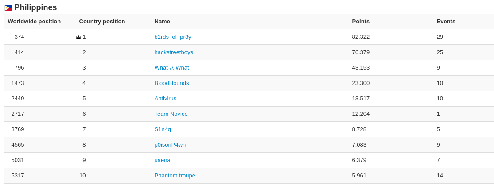

## About me

#### CTFtime points can be used for bragging rights, right? Here's me holding the top 1 position in the Philippines for 2020. Despite knowing that hackstreetboys (the real top CTF team in PH) will reclaim their rightful spot for 2021, I will continue to learn and improve my skillset and maybe defend the spot in the process of doing so. 

#### I'm just a student deeply interested in cybersec, especially on the fields of binary exploitation, exploit development, and anything malware related. If I get versed with pwn and reversing, I will apply what I've learned to conduct research regarding exploitation on the Android platform. Still getting started on the field tho, but will fearlessly continue to learn and grow. Aiming to be one of the top tier hackers within and representing the Philippines. *About will be updated sooner or later*

### Progress Logs
#### Since I stopped playing ctfs for a year (laptop broke rip) and only as of mid August that I got a new hand-me-down old model chromebook, I wanted to start learning exploit development seriously this time (even with school kinda being annoying). Thus, I began to set a goal that I do something exploit dev/pwning related everyday and make sure to document what I did. 
 - Sept 01, 2020: `Successfully finished memory corruption labs`
 - Sept 02, 2020: `Finished basic bof + shellcode challenge, stuck at shellcode lab2B`
 - Sept 03, 2020: `Finally wrote working open,read,write shellcode. Process = write shellcode, debug, rewrite shellcode`
 - Sept 04, 2020: `Failed to do something, sorry self`
 - Sept 05, 2020: `Done with shellcode lab :) learned how to create custom shellcode, but still needs improvement`
 - Sept 06, 2020: `Finished format string lecture problems, learned how to do multiple writes with format string vulns, got shell in fmt_lec04. Now have a better understanding on fmt str exploits.`
 - Sept 07, 2020: `Solved lab4C (read strings from stack using fmtstr exploit); partial solve for lab4B`
 - Sept 08, 2020: `Solved lab4B, but not satisfied. Find a way to execute exploit outside gdb`
 - Sept 09, 2020: `found and triggered vulnerability on lab4A, got stuck with figuring out how many bytes are written, came up with an exploit plan but failed to do so. Peeked at a writeup and saw similar plan (maybe consider this a partial solve?)`
 - Sept 10, 2020: `Played around with rop lecture binaries, couldn't do anything because of canaries`
 - Sept 11, 2020: `Got shell with lab5C, simple ret2libc. Partial solve for lab5B (was able to execute /bin/dash but sigabrts prematurely)`
 - Sept 12, 2020: `Productive day, solved baby pwn from csaw quals + 1st python sandbox escape, baby rev from flareon`
 - Sept 13, 2020: `Reverse engineered prehistoric mario chall from ALLESCTF, wrote a bruteforce script for correct box values. Will begin writeups for solved CSAW quals challenges`
 - Sept 14, 2020: `Began initial analysis of RPISEC project 1 binary, tw33tchainz`
 - Sept 15, 2020: `Was able to reverse engineer the custom hash function in order to retrieve secret pass to verify as admin. Enabled debug mode and triggered format string vulnerability in print_menu()`
 - Sept 16, 2020: `Restructured code to connect gdb with running process. Also fixed code to set debug mode on for the challenge. Found a way to hijack control flow. Changed exit@got address to 0x1337 as a test, then entered exit functionality resulted in segfault invalid address 0x1337 :)`
 - Sept 17, 2020: `Popped a shell for project1 :) Format string multiple writes to overwrite exit got to stack then execute shellcode from there. Fucking satisfying.`
 - Sept 18, 2020: `Rootcon CTF quals started, focused on pwn chall only, but got stuck.`
 - Sept 19, 2020: `Continued attempt on previous work but to no avail. Get a glimpse of how hard rootcon ctf is and promise to self to come back stronger for next year. Aside from that, solved three challs (2 pwn/1 rev) from downunder ctf. Continuing to work on chall #3`
 - Sept 20, 2020: `Solved return to revenge chall from DownUnder ctf, learned to bypass baby seccomp`
 - Sept 21, 2020: `Published writeups for solved downunder ctf challenges. Analyzed exploit for revenge chall and echo server`
 - Sept 22, 2020: `Found and triggered vulnerabilities for lab6C. Had to peek at a writeup to know that I needed a partial overwrite to solve the chall (I overcomplicated reversing it and trying to think of the solution when in fact it was that simple)`
 - Sept 23, 2020: `Reversed lab6B, found continuous memory read in hash_pass - can overwrite attempts,results variables. Haven't found a way to exploit it yet. Read some self improvement articles from azerialabs to have motivation/to learn a better learning process`
 - Sept 24, 2020: `Skipped lab6B, stack isn't the same witht the writeups I read i dunno why. It doesn't let me leak the return address, only until the attempts and results variable. Worked on lab6A instead, where I identified the vuln quickly and got it to segfault. Was able to redirect code flow by partial overwrite but no plan from that point. Also started learning how to use git, made my first commit through command line today.`
 - Sept 25, 2020: `Another productive day, solved a lot of challenges from EKOPARTY, then some from darkCTF. Will continue playing as there are 11 ctfs this weekend`
 - Sept 26-27, 2020: `Got pretty busy with ctfs, 11 ctfs in 2 days. Focused mostly on EKOPARTY which I placed 92nd and some Bsides Boston`
 - Sept 28, 2020: `Created writeups for solved challenges, tried to solve DarkCTF pwnables which I haven't got the chance to solve`
 - Sept 29, 2020: `Started learning about SIGROP`
 - Sept 30, 2020: `Understood how to bypass aslr. Created a discord bot to assign a role when a certain emoji is reacted`

## October
 - Oct 1, 2020: `Started learning about heap exploitation, solved my first uaf :)`
 - Oct 2, 2020: `Played around and solved lab7C, but still need to understand heap memory deeper`
 - Oct 3-4, 2020: `Joined in the b01lers bootcamp CTF to test what I learned about memory corruption the past month; satisfied with the results, placed 92nd/500+ teams`
 - Oct 5, 2020: `Created writeups for solved challenges.`
 - Oct 6-7, 2020: `Started reading on heap internals`
 - Oct 8, 2020: `Not much, focused on finishing schoolworks. Reread heap internal articles`
 - Oct 9, 2020: `Solved the stack canary chall from b01lers. Continued reading on heap internals, beginning to understand something somehow`
 - Oct 10-11, 2020: `Focused on playing DamCTF, though I only solved the easy ones.`
 - Oct 12, 2020: `Currently experimenting on what bin freed chunks go to. Results differ from articles I have read, which confuses me. Will read some more and continue tomorrow.`
 - Oct 13, 2020: `I think I finally understand which bins chunks go when they are freed. I'll read some more then start learning how to actually do exploits.`
 - Oct 14, 2020: `Realized some of the articles I read aren't applicable since the glibc version on my device is the one with tcache implemented; so instead of going to their respective bins immediately, chunks are being placed into the tcache bin. Found out after debugging a fastbin technique.`
 - Oct 15-16, 2020: `Got pretty busy with schoolworks didn't have time to learn pwn :(((`
 - Oct 17, 2020: `Focusing on hacktober ctf. Attempted to play the pwn challenge from N1CTF with had the highest amount of solves, it was a heap challenge which I managed to segfault using UAF, but still figuring out the next step/s.`
 - Oct 18, 2020: `Disappointed and feel I wasted my time on hacktober ctf (challs were very guessy asf). Will continue learning heap later tonight.`
 - Oct 19, 2020: `Began installing the needed tools to debug heap challs (pwninit, rust)`
 - Oct 20, 2020: `Successfully installed the needed tools and dependencies, time to start learning heap hacking.`
 - Oct 21, 2020: `Played some syskronCTF challs`
 - Oct 22, 2020: `Figured out how to debug with ld_preload and with the right ld patched into the binary`
 - Oct 23-31, 2020: `Participated in quite a lot of ctfs that happened during this time period. Details to come later.`

## November
 - Nov 1, 2020: `Played in CyberyoddhaCTF and NACTF, solved a lot of challs which are pretty good as an indicator of my current knowledge`
 - Nov 2, 2020: `Solved four android reversing challs from MOBISEC`
 - Nov 3, 2020: `Took a step back in order to reorganize my thoughts`
 - Nov 4-5, 2020: `Attempted to try cttt again but failed. Created writeups for solved NACTF tasks`
 - Nov 6, 2020: `Did a run down of the writeups for the heap challenges from NACTF posted by other people, will begin analysis tomorrow. Started watching heap lecture from pwncollege`
 - Nov 7-8, 2020: `Participated and solved challenges in Sunshine CTF instead of learning heap and doing schoolwork`
 - Nov 9, 2020: `Beginning to have an understanding of the tcache poison technique after reading writeups of NACTF's covid tracker challenge. Writeup to come later.`
 - Nov 10, 2020: `Was able to pop a shell after following HK's writeup. Still have questions regarding on how editing/controlling the fd pointer affects the exploit and how to piece it all together. Might need to reread malloc internals again.`
 - Nov 11-12, 2020: `Continuing analysis for the tcache poison exploit after doing midterms requirements. Still getting clarification on how the exploit works. Learned about __free/__malloc hooks.`
 - Nov 13, 2020: `I FINALLY UNDERSTOOD WHAT'S HAPPENING WITH THE EXPLOIT. EVEN CHANGED THE ORIGINAL CODE TO MAKE IT MUCH BETTER`
 - Nov 14-17, 2020: `Focused on midterms`
 - Nov 18, 2020: `Temporarily done with some midterm exams. Had the time to finish my cttt writeup and do readings on SIGROP exploits`
 - Nov 19-22, 2020: `Finished my mf midterms. Got time to create a sigrop mini writeup + solve two challs from pwnable.tw`
 - Nov 23, 2020: `Added new stuff to my discord bot code. Did a preliminary reverse engineering and created the exploit utilities needed to solve the heap challenge from Bsides Delhi 2020.`
 - Nov 24, 2020: `Studied the exploit for the heap challenge from Bsides Delhi, learned new info regarding libc leaks using the unsorted bin and exploiting double frees. Attempting to reverse hacknote from pwnable.tw`
 - Nov 25-26, 2020: `Experimented with htb academy and tryhackme. Finished 4 modules from academy, was able to hack the invite code to join the main platform`
 - Nov 27, 2020: `Finished some modules from tryhackme and hackthebox academy again. Breezed through the babyheap challs from pwn.college, will continue learning from there and solve all heap assignments.`
 - Nov 28-30, 2020: `Played in the InterIUT CTF with r3dact0r, I wiped the board for the android reversing challs. Got to play with new android reversing tools, excited to use them more often.`

## December
 - December 1, 2020: `Got experience with reversing an android application that uses dynamic code loading. Will attempt to do something related to heap exploitation for every day during this month.`
 - December 2, 2020: `Finished watching the dynamic allocator misuse lecture from pwn college, cleared some questions I had about how the allocator works. Finally properly understood how editing the fd pointer helps in certain exploit scenarios. Solved level 5 heap by controlling fd pointers to bypass authentication.`
 - December 3, 2020: `Solved level6&7 babyheap. Idea was to control the fd pointer of the tcache_chunk[1] so that we can control the pointer value of tcache_chunk[0] thus having the ability to control what the allocator returns to us when we malloc memory`
 - December 4-5: `Mainly focused on days 3 and 4 of the tryhackme advent challenges + some rooms`
 - December 6-31: `CTF galore, tryhackme grind (advent of cyber + some rooms), rushed 1 month worth of due assignments in 5 days. Fun times.`

## January
 - January 1, 2021: `Powerwashed my laptop and reinstalled the tools I need for my ctf setup.`
 - January 2, 2021: `Solved both android challenges from GRIMMCON 2020. After creating writeups, I will attempt to solve the waf (heap) challenge from the same ctf.`
 - January 3, 2021: `Got frida-gadget to work on a device without root. Time to learn android hacking with frida :) Also tried doing one of the fastbin challenges from nightmare, got to play with heap consolidation but will need to study about it more.`
 - January 4, 2021: `Beginning to understand some heap consolidation + chunk metadata stuff. Heap overflows are a powerful primitive to have for heap grooming. TIL that the dup in fastbin dup/tcache dup means duplication.`
 - January 5 - 11, 2021: `Continuous lapse of judgement + experimented with some android re challs`
 - January 12, 2021: `Finally beginning to realize how powerful the poison null byte -> overlapping chunks technique is for heap exploitation.`
 - January 13 - 17, 2021: `Did absolutely nothing then promised myself I would be productive for the rest of the year.`
 - January 18, 2021: `Began doing my final requirements for the first sem first, then did the hacker methodology room from tryhackme.`
 - January 19, 2021: `Finished some of the hardest requirements, had the time to study and do some xss attacks on the owasp room.`
 - January 20, 2021: `4 requirements left to do. Completed the basic pentesting room and learned how to use hydra for brute force attacks.`
 - January 21, 2021: `2 reqs left, maybe 3 if another one gets added tomorrow. Completed the root me room from tryhackme, got to refresh what I learned for file upload vulns and basic privesc. Made some progress with the fetusheap chall.`
 - January 22, 2021: `1 left (or 2 if another requirement gets added). Got user and root flags for the bounty hunter room on thm - was pretty straightforward. I enjoyed the privesc part even if it was easy. Watched motivational + self-discipline videos`
 - January 23, 2021: `Finally finished all of my requirements. Time to start learning hacking again. Day 1 of reading malloc source code until I get decent with my understanding of the dynamic allocator internals.`
 - January 24, 2021: `Did some rooms on tryhackme (networking + lazy admin) was pretty fun to read the exploit details from searchsploit to solve the box, solved the oauth challenge from hacker101 ctf`
 - January 25, 2021: `Completed the ff rooms on tryhackme: Ohsint, Brooklyn99, and BruteIt. They were fairly easy. Did a simple sigrop on 0x41414141 ctf. Other pwn are hard ngl`
 - January 26, 2021: `First time exploiting a vulnerable cronjob on tryhackme, was pretty fun. Worked on some guessy ctf challs (shadowctf), will work on the pwn from 0x41414141 later after class.`
 - January 27, 2021: `Our place had an 8-hour brownout, but I saved a heap challenge to practice beforehand. Pwned the baby heap from fireshellctf 2019 and got to play with tcache poisons a little bit more. I should probably make it a habit to check .bss variables. Got the user flag for the gamingserver room on thm but couldn't escalate privs since I couldn't download files on the free attackbox.`
 - January 28, 2021: `Did the LianYu room on tryhackme, needed some help with the stego enumeration but handled the privesc pretty easily. Solved my first baby android pwn + did some app dev challenges`
 - January 29, 2021: `Lazy day on tryhackme today, only finished the previous rooms that I have not completed due to the attack box expiring (day 24 of the adventofcode2020, last 2 flags for the blue box). Created a content hijacking poc for an android app to get the flag which I'm pretty happy about :)`